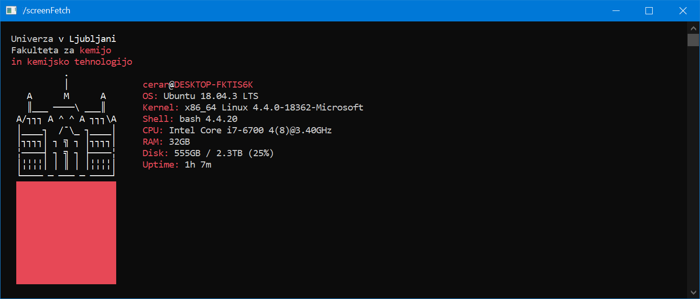

# screenFetch - The Bash Screenshot Information Tool

<!-- [](https://github.com/JureCerar/xslib/releases) -->

[](https://www.gnu.org/licenses/gpl-3.0.html)

## What is screenFetch?

screenFetch is a "Bash Screenshot Information Tool". This handy Bash
script can be used to generate one of those nifty terminal theme
information + ASCII distribution logos you see in everyone's screenshots
nowadays. It will auto-detect your distribution and display an ASCII
version of that distribution's logo and some valuable information to the
right. There are options to specify no ASCII art, colors, taking a
screenshot upon displaying info, and even customizing the screenshot
command! This script is very easy to add to and can easily be extended.

## Example (UL ASCII logo)



## Installation
To install type the following as *root* (or *sudo*):
```bash
make install
```
**NOTE:** Add `DIR=custom/install/dir` to install to non-standard location. 
## Running screenfetch

To run screenFetch, open a terminal of some sort and type in the command `screenfetch`
or wherever you saved the script to. This will generate an ASCII logo with the
information printed to the side of the logo. There are some options that may be
specified on the command line, and those are shown below or by executing `screenfetch -h`:
```
-v                 Verbose output.
-o 'OPTIONS'       Allows for setting script variables on the
                   command line. Must be in the following format...
                   'OPTION1="OPTIONARG1";OPTION2="OPTIONARG2"'
-d '+var;-var;var' Allows for setting what information is displayed
                   on the command line. You can add displays with +var,var. You
                   can delete displays with -var,var. Setting without + or - will
                   set display to that explicit combination. Add and delete statements
                   may be used in conjunction by placing a ; between them as so:
                   +var,var,var;-var,var.
-n                 Do not display ASCII distribution logo.
-N                 Strip all color from output.
-w                 Wrap long lines.
-t                 Truncate output based on terminal width (Experimental!).
-p                 Output in portrait mode, with logo above info.
-s [-u IMGHOST]    Using this flag tells the script that you want it
                   to take a screenshot. Use the -m flag if you would like
                   to move it to a new location afterwards.
-c string          You may change the outputted colors with -c. The format is
                   as follows: [0-9][0-9],[0-9][0-9]. The first argument controls the
                   ASCII logo colors and the label colors. The second argument
                   controls the colors of the information found. One argument may be
                   used without the other.
-a 'PATH'          You can specify a custom ASCII art by passing the path
                   to a Bash script, defining `startline` and `fulloutput`
                   variables, and optionally `labelcolor` and `textcolor`.
                   See the `asciiText` function in the source code for more
                   information on the variables format.
-S 'COMMAND'       Here you can specify a custom screenshot command for
                   the script to execute. Surrounding quotes are required.
-D 'DISTRO'        Here you can specify your distribution for the script
                   to use. Surrounding quotes are required.
-A 'DISTRO'        Here you can specify the distribution art that you want
                   displayed. This is for when you want your distro
                   detected but want to display a different logo.
-E                 Suppress output of errors.
-V, --version      Display current script version.
-h, --help         Display this help.
```

## How to display before motd?

1. Disable motd by adding line to `etc/ssh/sshd_config`:
```bash
PrintMotd no  
```

2. Restart sshd client:
```bash
sudo systemctl restart sshd
```

3. Edit `/etc/profile` and at the end add
```
path/to/screenfetch [-options]
cat /etc/motd
```

**NOTE:** This works for CentOS distro. For Ubuntu etc. procedure may be somewhat different. Also try some experimenting with dynamic motd?


## Changes by Jure Cerar
- Removed OS logos & added UL logo.   
- Added `skip_lines` options.
- More primitive distro detection.   
- Changed CPU & MEM detection.
- Multi GPU detection.  
- Changed output order.
- Removed "bloat" functionality.

## Original repository

Original repository can be found [here](https://github.com/KittyKatt/screenFetch).
