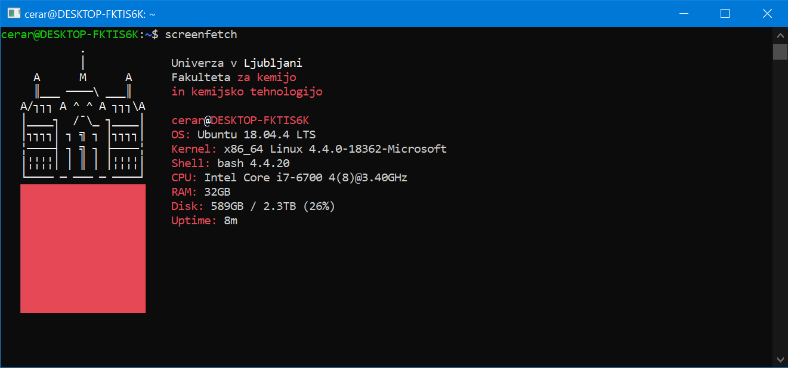

# screenFetch - The Bash Screenshot Information Tool


[](https://www.gnu.org/software/bash/)
[](https://www.gnu.org/licenses/gpl-3.0.html)

## What is screenFetch?
screenFetch is a "Bash Screenshot Information Tool". This handy Bash
script can be used to generate one of those nifty terminal theme
information + ASCII logos you see in everyone's screenshots nowadays.  
There are options to specify no ASCII art, colors, taking a
screenshot upon displaying info, and even customizing the screenshot
command! This script is very easy to add to and can easily be extended.

## Installing screenFetch
This is a script so no installation is needed - Just make sure to make it executable with `chmod +x` and then run with `./screenfetch.sh`.  

However, out of convenience `Makefile` is included. For 'standard' installation, type the following as *root* (or *sudo*):
```bash
make install
```
**NOTE:** Add `DIR=path/to/dir/` to install script to non-standard location.  

## Running screenFetch
To run screenFetch, open a terminal of some sort and type in the command `screenfetch`
or wherever you saved the script to. This will generate an ASCII logo with the
information printed to the side of the logo. There are some options that may be
specified on the command line, and those are shown below or by executing `screenfetch -h`:

In [UL directory](UL/) are alternative versions of FKKT UL logo. Use with:
```bash
screenfetch -a logo.sh
```

## How to display before motd?
1. Disable motd by adding line to `etc/ssh/sshd_config`:
```bash
PrintMotd no  
```

2. Restart sshd client:
```bash
sudo systemctl restart sshd
```

3. Edit `/etc/profile` and at the end add
```bash
path/to/screenfetch [-options]
cat /etc/motd
```

**NOTE:** This works for CentOS distro. For Ubuntu etc. procedure may be somewhat different. Also try some experimenting with dynamic motd?

## Changes by Jure Cerar
- Removed OS logos & added UL logo.   
- Added `skiplines` options.
- More primitive distro detection.   
- Changed CPU & MEM detection.
- Multi GPU detection.  
- Changed output order.
- Removed some OS specific functionality for faster runs.

## License
This program is licensed under the **GNU General Public License v3.0**

Original repository can be found [here](https://github.com/KittyKatt/screenFetch).

Copyright (C) 2019-2020

This program is free software: you can redistribute it and/or modify it under the terms of the GNU General Public License as published by the Free Software Foundation, either version 3 of the License, or (at your option) any later version.

This program is distributed in the hope that it will be useful, but WITHOUT ANY WARRANTY; without even the implied warranty of MERCHANTABILITY or FITNESS FOR A PARTICULAR PURPOSE. See the GNU General Public License for more details.

You should have received a copy of the GNU General Public License along with this program. If not, see http://www.gnu.org/licenses/.
